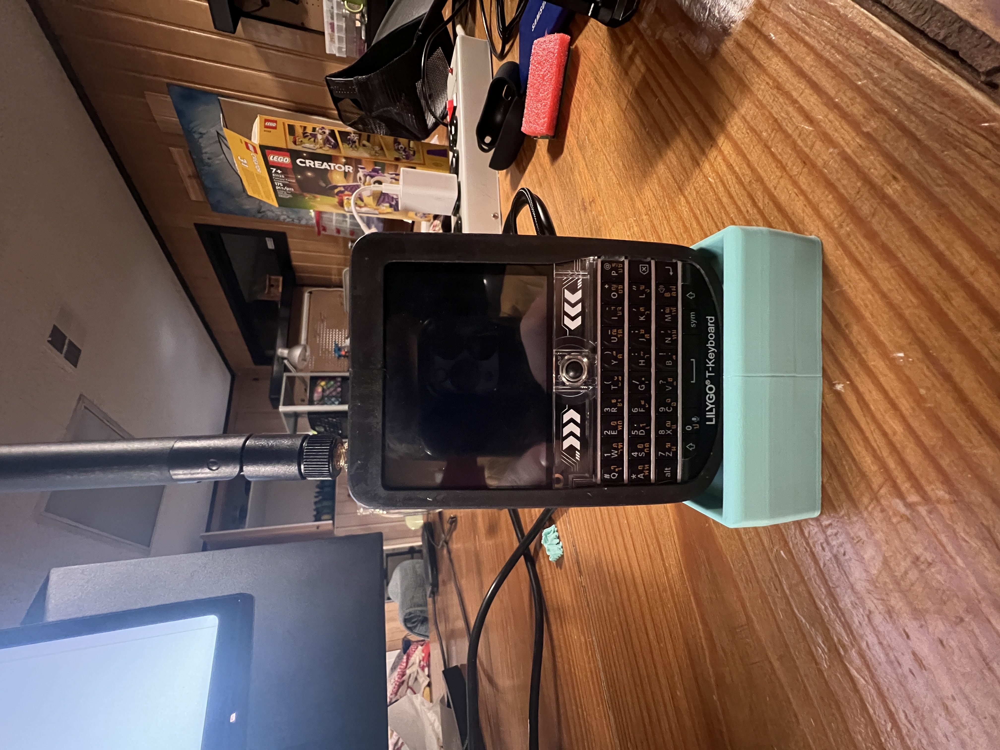
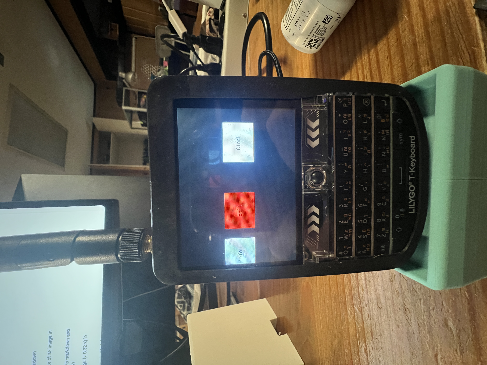
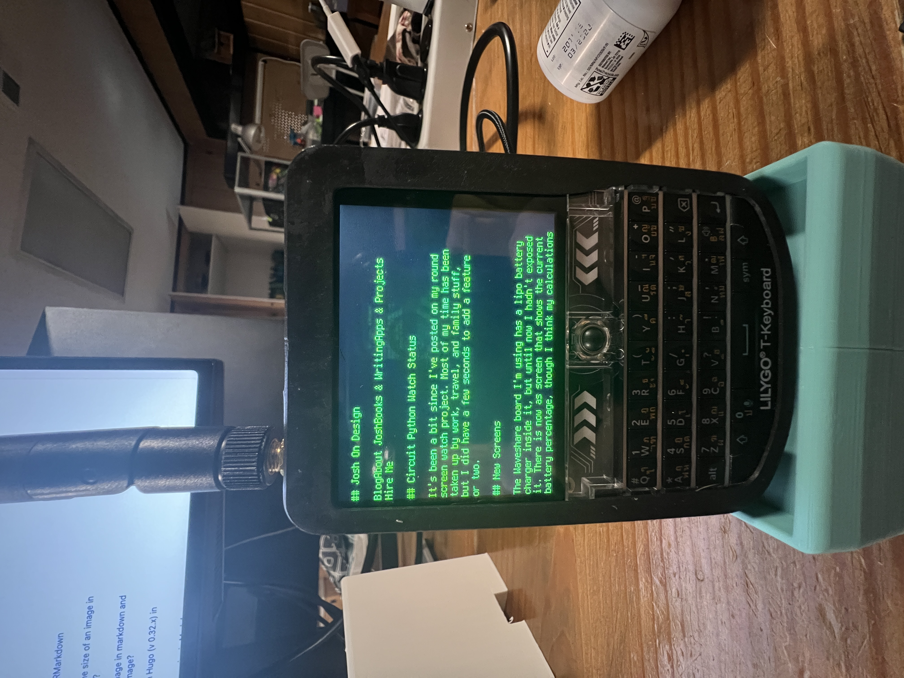

# The Lilly Go Tdeck: A Small Portable Blackberry-Looking Device


This is the Lilly Go Tdeck. It runs on an ESP32 chipset and has WiFi, BLE, an SD card slot, a keyboard, LORA, a speaker, and a microphone. It's like a little pocket phone. I've been working on seeing how far I can really push this little guy.

## Menu System


This is a simple horizontal menu system I created that lets you add to an array the name of the application and the function to run it. As simple as it gets.
```
menu = [
    ["System info", stats],
    ["Exit", exit_menu],
    ["Clock", clock],
    ["WiFi", wifiM],
    ["Internet", internet],
]
```

My uncle [Josh On Design](https://joshondesign.com) even got a tiny HTML parser and renderer that takes real HTML, strips it down to just the main headers and paragraph tags, and then displays it on the screen. The main issue we have been having is the speed of the screen. Since it is just over serial, it is pretty slow, and we are not able to update the whole screen very quickly.

