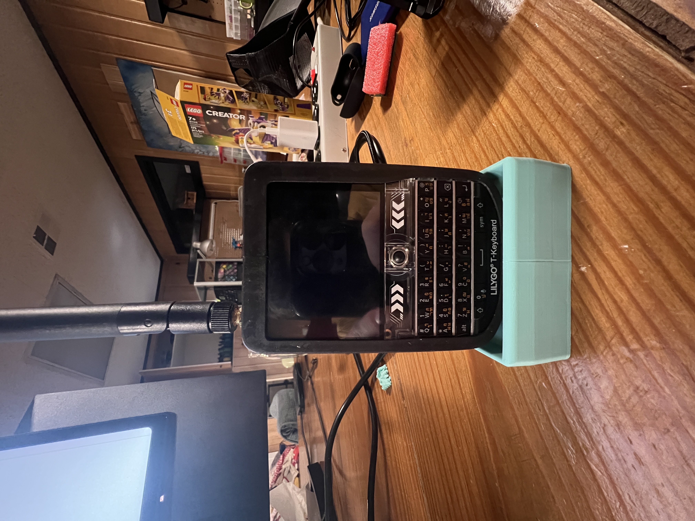

# The Lilly Go Tdeck a small porable Blackberry looking thing



This is the Lilly Go Tdeck, It runs on a ESP32 chipset it has wifi, BLE, SD card slot a keyboard LORA, Speacker and a flipping microphone. Its like its a little pocket phone. Ive been doing some work on see how far I can really push this little guy

## Menu


This is a simple horizontal menu system I created that lets you add to an array the name of the application and the function to run it. As simple as it gets.
```
menu = [
    ["System info", stats],
    ["Exit", exit_menu],
    ["Clock", clock],
    ["Wifi", wifiM],
    ["Internet", internet],
]
```

My Uncle [Josh On Desing](https://joshondesign.com) Even got a tiny HTML Parser and render that takes real HTML strips it down to just the main headers and the paragraph tags and then displays it on the screen. The main issues we have been having is the speed of the screen. Sence it is just over serial it is pretty slow and we are not able to update the whole screen verry quickly.

